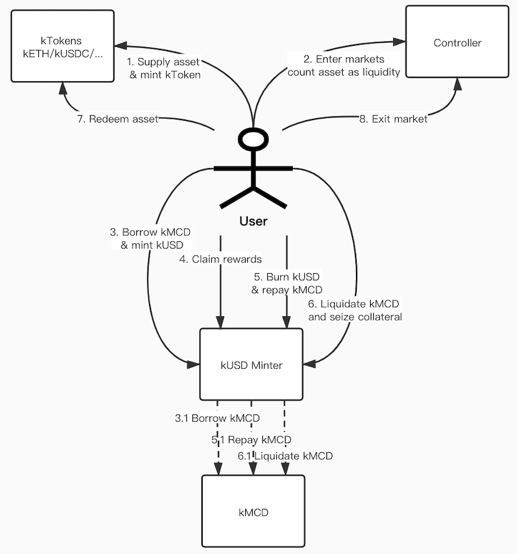

# Contracts Overview

---
Kine is a decentralized protocol which establishes general purpose liquidity pools backed by a customizable portfolio of digital assets. The liquidity pool allows traders to enter and exit derivatives contracts directly according to the pool's price feeds, avoiding the need of counterparties. This mechanism lifts the restriction on existing peer-to-pool (aka peer-to-contract) trading protocols, by expanding the collateral space to any Ethereum-based assets.

Kine Protocol allows users to stake ETH and ERC-20 assets as collaterals. Assets staked into the contracts increase the user's debt limit (aka 'liquidation' in codes). Users with unused debt limit can mint kUSD, a synthetic USD-pegging digital asset backed by an over-collateralized liquidity pool. kUSD is the only asset accepted by Kine Exchange, a peer-to-pool derivatives exchange providing multi-asset exposure with zero-slippage trading experience.

Users incur a Multi-Collateralized Debt (MCD) when they mint kUSD, and become part of the pooled counterparty facing traders on Kine Exchange. MCD price may increase or decrease independent of their original minted value, based on the net exposures taken by the liquidity pool. The pool provides liquidity to all trading pairs quoted on Kine Exchange. The exchange accumulates trading fees, and distribute to the pool stakers through ```KUSDMinter``` contract. It also reports the MCD price and adjust kUSD supply through the ```Kaptain``` contract.

Users may repay their MCD debt by burning kUSD, which allows them to withdraw part or full of their staked assets. When a user's debt limit is exceeded (aka 'shortfall' in codes), a 3rd-party liquidator may repay the MCD debt on the user's behalf and seize part of its staking assets with a mark-up.


## Architecture




Two brief diagrams as above shows composition of Kine contracts and how should users interact with them.


### KToken

---

```KToken``` contract is the staking contract that allow users to stake/unstake their ERC20/ETH asset and gain/burn kTokens which represent their staking balances. There are many instances of ```KToken``` contract, each one maintain one kind of asset. By minting kTokens, user gain the ability to use kTokens as collateral.

Currently there are two types of kTokens: KErc20 and KEther. ```KErc20``` wrap a ERC20 underlying asset while ```KEther``` wrap Ether asset.

When user stake(mint), unstake(redeem) or transfer kTokens, all user's actions will go through ```Controller``` first to check if user's liquidation is sufficient and will forbidden user's action if it is under-collateralized.

```KErc20``` follows DelegateProxy pattern to realize upgradable. Each kErc20 token will have two contracts: ```KErc20Delegate``` and ```KErc20Delegator```. ```KErc20Delegator``` is the storage contract while ```KErc20Delegate``` is logics implementation contract.

<span style="color:green">**Mint**</green>

The mint function transfers an asset into the protocol as staking. The user receives a quantity of kTokens equal to the underlying tokens supplied, representing the staking asset balance.

**`KErc20`**

```solidity
function mint(uint mintAmount) external returns (uint)
```

- `msg.sender`: The account which shall stake the asset, and gain the minted kTokens.
- `mintAmount`: The amount of the asset to be staked, in units of the underlying asset.
- `RETURN`: The actual minted kToken amount.

Before supplying an asset, users must first approve the kToken to access their token balance.

**`KEther`**

```solidity
function mint() external payable returns (uint)
```

- `msg.sender`: The account which shall stke the asset, and gain the minted kTokens.
- `msg.value`: The amount of ether to be supplied, in wei.
- `RETURN`: The actual minted kToken amount.

<span style="color:green">**Redeem**</green>

The redeem function converts a specified quantity of kTokens into the underlying asset, and returns them to the user. The amount redeemed must be less than the user's Account Liquidity and the market's available liquidity.

**`KErc20/KEther`**

```solidity
function redeem(uint redeemTokens) external
```

- `msg.sender`: The account to which redeemed asset shall be transferred.
- `redeemTokens`: The number of kTokens to be redeemed.

<span style="color:green">**Transfer**</green>

Transfer is an ERC20 method that allows accounts to send tokens to other Ethereum addresses. A kToken transfer will fail if the account has entered that kToken market and the transfer would have put the account into a state of negative liquidity.

**`KErc20`**

```solidity
function transfer(address dst, uint256 amount) external returns (bool)
```

- `dst`: The transfer recipient address.
- `amount`: The amount of kTokens to transfer.
- `RETURN`: Returns a boolean value indicating whether or not the operation succeeded.

<span style="color:green">**GetCash**</green>

Cash is the amount of underlying balance owned by this kToken contract.

**`KErc20/KEther`**

```solidity
function getCash() external view returns (uint)
```

- `RETURN`: The quantity of underlying asset owned by this contract.

<span style="color:green">**TotalSupply**</green>

Total Supply is the number of tokens currently in circulation in this kToken market.

**`KErc20/KEther`**

```solidity
function totalSupply() external view returns (uint)
```

- `RETURN`: The total number of tokens in circulation for the market.

<span style="color:green">**KeyEvents**</green>

```solidity
Mint(address minter, uint mintAmount, uint mintTokens) // Emitted upon a successful Mint.
Redeem(address redeemer, uint redeemTokens) //Emitted upon a successful Redeem.
Transfer(address indexed from, address indexed to, uint amount) //Emitted upon a successful Transfer.
```


### KMCD

---

``KMCD`` contract let stakers to borrow/repay Kine MCD (kMCD) through ``KUSDMinter`` contract when user mint/burn kUSD in ``KUSDMinter`` contract.

When user borrow/repay Kine MCD, all user's actions will go through ``Controller`` contract to check if borrower's liquidation is sufficient and will forbid user action if it is under-collateralized.

``KMCD`` also follows DelegateProxy pattern to realize upgradable.

<span style="color:green">**BorrowBehalf**</green>

The borrowBehalf function can be only called by ``KUSDMinter`` contract when user mint kUSD, it will create a kMCD borrow (stake) balance to borrower. The amount borrowed must be less than the borrower's Account Liquidity.

```solidity
function borrowBehalf(address payable borrower, uint borrowAmount) onlyMinter external
```

- `msg.sender`: The caller must be ``KUSDMinter`` contract, otherwise will revert.
- `borrower`: The account to which borrowed (staked) kMCD balance shall be created.
- `borrowAmount`: The amount of the kMCD to be borrowed.

<span style="color:green">**RepayBorrowBehalf**</green>

The repayBorrowBehalf function can be only called by ``KUSDMinter`` contract when user burn kUSD, it will reduce the target user's borrow balance.

```solidity
function repayBorrowBehalf(address borrower, uint repayAmount) onlyMinter external
```

- `msg.sender`: The caller must be ``KUSDMinter`` contract, otherwise will revert.
- `borrower`: The account from whom borrowed kMCD balance shall be reduced.
- `repayAmount`: The amount of the kMCD to be reduced.

<span style="color:green">**LiquidateBorrowBehalf**</green>

The liquidateBorrowBehalf function can be only called by ``KUSDMinter`` contract when user burn kUSD to liquidate. A user who has negative account liquidity is subject to liquidation by other users. When a liquidation occurs, a liquidator may repay some or all of borrowed kMCD on behalf of a borrower and in return receive a discounted amount of collateral held by the kMCD borrower. The discount is defined as the liquidation incentive.A liquidator may close up to a certain fixed percentage (i.e. close factor) of any individual kMCD borrow of the underwater account.

```solidity
function liquidateBorrowBehalf(address liquidator, address borrower, uint repayAmount, KTokenInterface kTokenCollateral) onlyMinter external
```

- `msg.sender`: The caller must be ``KUSDMinter`` contract, otherwise will revert.
- `liquidator`: The account which shall liquidate the borrower by repaying their kMCD and seizing their collateral.
- `borrower`: The account with negative account liquidity that shall be liquidated.
- `repayAmount`: The amount of the borrowed kMCD to be repaid and converted into collateral.
- `kTokenCollateral`: The address of the kToken currently held as collateral by a borrower, that the liquidator shall seize.

<span style="color:green">**BorrowBalance**</green>

BorrowBalance shows given account's borrowed kMCD balance.

```solidity
function borrowBalance(address account) public view returns (uint)
```

- `account`: The account of whom kMCD balance is queried.
- `RETURN`: The borrowed kMCD balance of account.

<span style="color:green">**TotalBorrows**</green>

Total borrows is total amount of kMCD that being borrowed.

```solidity
function totalBorrows() public view returns (uint)
```

- `RETURN`: The total borrowed kMCD balance.

<span style="color:green">**KeyEvents**</green>

```solidity
Borrow(address borrower, uint borrowAmount, uint accountBorrows, uint totalBorrows) // Emitted upon a successful Borrow.
RepayBorrow(address payer, address borrower, uint repayAmount, uint accountBorrows, uint totalBorrows) //Emitted upon a successful RepayBorrow.
LiquidateBorrow(address liquidator, address borrower, uint repayAmount, address kTokenCollateral, uint seizeTokens) //Emitted upon a successful LiquidateBorrow.
```


### Controller

---

The Controller is the risk management layer of the Kine Protocol. It determines how much collateral a user is required to maintain, and whether (and by how much) a user can be liquidated. Each time a user interacts with a kToken or kUSD minter, the Controller is asked to approve or deny the transaction.

The Controller maps user balances to prices (via the Price Oracle) to risk weights (called Collateral Factors) to make its determinations. Users explicitly list which assets they would like included in their risk scoring, by calling Enter Markets and Exit Market.

Controller also follows DelegateProxy pattern to realize upgradable.

<span style="color:green">**EnterMarkets**</green>

Enter into a list of markets. In order to supply collateral or borrow kMCD, it must be entered first.

```solidity
function enterMarkets(address[] memory kTokens) public
```

- `msg.sender`: The account which shall enter the given markets.
- `kTokens`: The addresses of the kToken markets to enter.

<span style="color:green">**ExitMarket**</green>

Exit a market. Removes asset from sender's account liquidity calculation.

```solidity
function exitMarket(address kTokenAddress) external
```

- `msg.sender`: The account which shall exit the given market.
- `kTokenAddress`: The address of kToken market to exit.

<span style="color:green">**GetAssetsIn**</green>

Get the list of markets an account is currently entered into.

```solidity
function getAssetsIn(address account) external view returns (KToken[] memory)
```

- `account`: The account whose list of entered markets shall be queried.
- `RETURN`: The addresses of markets which is currently entered into.

<span style="color:green">**Markets (Collateral Factor)**</green>

A kToken's collateral factor represents the proportionate increase in liquidity (kMCD borrow limit) that an account receives by minting the kToken.

Generally, large or liquid assets have high collateral factors, while small or illiquid assets have low collateral factors. If an asset has a 0% collateral factor, it can't be used as collateral (or seized in liquidation).

```solidity
function markets(address kTokenAddress) view returns (bool, uint)
```

- `kTokenAddress`: The address of the kToken to check if listed and get the collateral factor for.
- `RETURN`: Tuple of values (isListed, collateralFactorMantissa); isListed represents whether the controller recognizes this kToken; collateralFactorMantissa, scaled by 1e18, is multiplied by a supply balance to determine how much liquidation is provided.

<span style="color:green">**Get Account Liquidity**</green>

Account Liquidity represents the USD value of kMCD borrowable by a user, before it reaches liquidation. Users with a shortfall (negative liquidity) are subject to liquidation, and can’t withdraw or borrow kMCD until Account Liquidity is positive again.

For each market the user has entered into, their supplied balance is multiplied by the market’s collateral factor, and summed; kMCD borrow balances are then subtracted, to equal Account Liquidity. Borrowing kMCD reduces Account Liquidity; withdrawing an asset reduces Account Liquidity by the asset’s collateral factor times each USD withdrawn.

```solidity
function getAccountLiquidity(address account) public view returns (uint, uint)
```

- `account`: The account whose liquidity shall be calculated.
- `RETURN`: Tuple of values (liquidity, shortfall). A non-zero liquidity value indicates the account has available account liquidity. A non-zero shortfall value indicates the account is currently below his/her collateral requirement and is subject to liquidation. At most one of liquidity or shortfall shall be non-zero.

<span style="color:green">**Close Factor**</green>

The percent, ranging from 0% to 100%, of a liquidate-able account's kMCD borrow that can be repaid in a single liquidate transaction.

```solidity
function closeFactorMantissa() view returns (uint)
```

- `RETURN`: The closeFactor, scaled by 1e18, is multiplied by kMCD borrow balance to determine how much could be closed.

<span style="color:green">**Liquidation Incentive**</green>

The additional collateral given to liquidators as an incentive to perform liquidation of underwater accounts. For example, if the liquidation incentive is 1.1, liquidators receive an extra 10% of the staking collateral for every unit they close.

```solidity
function liquidationIncentiveMantissa() view returns (uint)
```

- `RETURN`: The liquidationIncentive, scaled by 1e18, is multiplied by the closed kMCD borrow amount from the liquidator to determine how much collateral can be seized.

<span style="color:green">**KeyEvents**</green>

```solidity
MarketEntered(KToken kToken, address account) //Emitted upon a successful Enter Market.
MarketExited(KToken kToken, address account) //Emitted upon a successful Exit Market.
```


### KineUSD

---

KineUSD contract is an ERC20 contract, it can be mint/burn when kMCD is borrowed/repaid by user through ``KUSDMinter`` contract.

kUSD can be transferred into Kine Exchange to trade for different kinds of synthetic assets, and the total value of synthetic assests will reflected back by the total supply of kUSD through treasury mint/burn.  

<span style="color:green">**Mint**</green>

Mint function can only be called by ``KUSDMinter`` and will mint kUSD to specified user.

```solidity
function mint(address account, uint amount) external onlyMinter
```

- `msg.sender`: The caller can only be ``KUSDMinter`` contract, otherwise will revert.
- `account`: The account whom the kUSD shall mint to.
- `amount`: The amount of kUSD to mint.

<span style="color:green">**Burn**</green>

Burn function can only be called by ``KUSDMinter`` and will burn kUSD from specified user.

```solidity
function burn(address account, uint amount) external onlyMinter
```

- `msg.sender`: The caller can only be KUSDMinter contract.
- `account`: The account from whom the kUSD shall be burnt from.
- `amount`: The amount of kUSD to be burnt.

<span style="color:green">**KeyEvents**</green>

```solidity
Transfer(address indexed from, address indexed to, uint256 value) //Emitted upon a successful Transfer
```


### KUSDMinter

---

KUSDMinter contract allow users to borrow/repay kMCD to mint/burn kUSD. When user mint/burn kUSD, KUSDMinter will borrow/repay equivalent kMCD from ``KMCD`` contract on behalf of user according to kMCD price then. This will trigger Controller to check user's liquidity and permit or forbid user's action.

KUSDMinter is also the interface for users to liquidate other users' kMCD if they are under-collateralized in order to seize an amplified collateral.

KUSDMinter also allows Kine Exchange treasury account to update kUSD vault's balance to keep kUSD total supply synced with the total value of synthetic assets.

Users who borrowed kMCD to mint kUSD become the pooled counter parties in Kine Exchange, they took the risks that kMCD price may fluctuate. A proportion of trading fees together with Kine token reward will be distributed into `KUSDMinter` contract to reward these users. The reward will be periodically added to minter contract and will released to users in a preset release period.

KUSDMinter also follows DelegateProxy pattern to realize upgradable.

<span style="color:green">**Mint**</green>

Mint function borrow equivalent kMCD on behalf of user according to kMCD price and mint specified amount of kUSD to caller. When borrow kMCD from `KMCD` contract, controller will check if user's liquidity is sufficient and will permit or forbid user's action. Since mint function will change caller's borrowed kMCD amount, will update caller's reward status first. There is a start time that users can mint/burn kUSD, if time not reached, call will revert.

```solidity
function mint(uint kUSDAmount) external checkStart updateReward(msg.sender)
```

- `msg.sender`: The account to whom kUSD will mint to.
- `kUSDAmount`: The amount of kUSD to mint.

<span style="color:green">**Burn**</green>

Burn function burn specified amount of kUSD from caller and repay equivalent kMCD on behalf of user according to kMCD price. Since burn function will change caller's borrowed kMCD amount, will update caller's reward status first. There is a start time that users can mint/burn kUSD, if time not reached, call will revert.

```solidity
function burn(uint kUSDAmount) external checkStart updateReward(msg.sender)
```

- `msg.sender`: The account from whom kUSD will burn.
- `kUSDAmount`: The amount of kUSD to burn

<span style="color:green">**BurnMax**</green>

BurnMax function try to burn equivalent kUSD to caller's all borrowed kMCD. If kUSD is not enough to burn all borrowed kMCD, will just burn all kUSD and repay equivalent kMCD. Since burnMax function will change caller's borrowed kMCD amount, will update call's reward status first. There is a start time that users can mint/burn kUSD, if time not reached, call will revert.

```solidity
function burnMax() external checkStart updateReward(msg.sender)
```

- `msg.sender`: The account from whom kUSD will burn.

<span style="color:green">**Liquidate**</green>

Liquidate function call kMCD's liquidateBehalf function (see `KMCD`) on behalf of caller. If repay kMCD amount equivalent kUSD amount reached given maxBurnKUSDAmount, call will revert.

```solidity
function liquidate(address staker, uint unstakeKMCDAmount, uint maxBurnKUSDAmount, address kTokenCollateral) external checkStart updateReward(staker)
```

- `msg.sender`: The account which shall liquidate the borrower by repaying their kMCD and seizing their collateral.
- `staker`: The account with negative account liquidity that shall be liquidated.
- `unstakeKMCDAmount`: The amount of the borrowed kMCD to be repaid and converted into collateral.
- `maxBurnKUSDAmount`: The maximum allowed kUSD amount to be burnt to repay kMCD.
- `kTokenCollateral`: The address of the kToken currently held as collateral by staker, that the liquidator shall seize.

<span style="color:green">**Reward Earned**</green>

Earned function shows account's currently accrued reward.

```solidity
function earned(address account) public view returns (uint)
```

- `account`: The account of whom accrued reward shall be shown.
- `RETURN`: The accrued reward.

<span style="color:green">**Reward Claimable**</green>

Claimable function shows account's currently matured reward. User's accrued reward will mature gradually in a preset release period. The proportion of matured reward to accrued reward is the proportion of past time since last claim to the release period.

```solidity
function claimable(address account) external view returns (uint)
```

- `account`: The account of whom matured reward shall be shown.
- `RETURN`: The matured reward.

<span style="color:green">**Get Reward**</green>

GetReward function will transfer the matured reward to caller and start a new release period for left and new accrued reward.

```solidity
function getReward() external checkStart updateReward(msg.sender)
```

- `msg.sender`: The account matured reward will be transferred to.

<span style="color:green">**Treasury Mint**</green>

TreasuryMint function can only be called by Kine Exchange treasury account (see `Kaptain`), will mint kUSD to Kine vault to keep kUSD total supply synced with the total value of synthetic assets of Kine Exchange.

```solidity
function treasuryMint(uint amount) external onlyTreasury
```

- `msg.sender`: The treasury account of Kine system.
- `amount`: The increased value of synthetic assets of Kine Exchange.

<span style="color:green">**Treasury Burn**</green>

TreasuryBurn function can only be called by Kine treasury account (see `Kaptain`), will burn kUSD from Kine vault to keep kUSD total supply synced with the total value of synthetic assets of Kine Exchange.

```solidity
function treasuryBurn(uint amount) external onlyTreasury
```

- `msg.sender`: The treasury account of Kine system.
- `amount`: The decreased value of synthetic assets of Kine Exchange.

<span style="color:green">**KeyEvents**</green>

```solidity
Mint(address indexed user, uint mintKUSDAmount, uint stakedKMCDAmount, uint userStakesNew, uint totalStakesNew) //Emitted upon a successful Mint.
Burn(address indexed user, uint burntKUSDAmount, uint unstakedKMCDAmount, uint userStakesNew, uint totalStakesNew) //Emitted upon a successful Burn.
BurnMax(address indexed user, uint burntKUSDAmount, uint unstakedKMCDAmount, uint userStakesNew, uint totalStakesNew) //Emitted upon a successful BurnMax.
Liquidate(address indexed liquidator, address indexed staker, uint burntKUSDAmount, uint unstakedKMCDAmount, uint stakerStakesNew, uint totalStakesNew) //Emitted upon a successful Liquidate.
TreasuryMint(uint amount) //Emitted upon a successful TreasuryMint.
TreasuryBurn(uint amount) //Emitted upon a successful TreasuryBurn.
```


### KineOracle

---

KineOracle is built upon [*Compound Oracle*](https://compound.finance/docs/prices). Kine reutilize compound's `OpenOraclePriceData` contract to store reported prices, and built a customized view contract `KineOracle` to store prices that are signed by Kine reporter. For the tokens that have price in compound's `UniswapAnchoredView`, `KineOracle` will directly get price from it; for the token prices (kMCD, kine) that owned by Kine, `KineOracle` will maintain by itself using similar logics as `UniswapAnchoredView`.

Since kMCD price is always changing together with Kine vault kUSD balance, and which two are both coming from Kine Exchange, we have an additional contract - `Kaptain` to report the prices together with the vault kUSD balance change. So Kaptain contract is Kine Exchange's treasury account.

<span style="color:green">**Post Prices**</green>

Posts an array of prices to `OpenOraclePriceData` and saves them to `KineOracle`. Prices are expected to be in USD with 6 decimals of precision.

**`KineOracle`**

```solidity
function postPrices(bytes[] calldata messages, bytes[] calldata signatures, string[] calldata symbols) external onlyKaptain
```
- `msg.sender`: The caller can only be the Kaptain contract
- `messages[]`: The array of prices to sign. Each message is a bytes[] with the format: (string memory kind, uint64 timestamp, string memory key, uint64 value)
- `signatures[]`: An array of signatures corresponding to the messages. Each signature is a bytes[] with the format (bytes32 r, bytes32 s, uint8 v).
- `symbols[]`: An array of symbols corresponding to the price messages.

<span style="color:green">**Post MCD price**</green>

MCD price is calculated in `Kaptain` contract by updated kUSD total supply divided by kMCD total borrow balance. 

**`KineOracle`**

```solidity
function postMcdPrice(uint mcdPrice) external onlyKaptain
```

- `mcdPrice`: MCD price scaled by 1e6.

<span style="color:green">**Price**</green>

Get the most recent price for a token in USD with 6 decimals of precision.

**`KineOracle`**

```solidity
function price(string memory symbol) external view returns (uint)
```

- `symbol`: Symbol as a string
- `RETURN`: price for a token in USD with 6 decimals of precision.

<span style="color:green">**GetUnderlyingPrice**</green>

Get the most recent price for an underlying token of kToken in USD scaled by 1e(36 - token decimals).

**`KineOracle`**

```solidity
function getUnderlyingPrice(address kToken) external view returns (uint)
```

- `kToken`: kToken address of which underlying token price will be get.
- `RETURN`: underlying token price of kToken in USD scaled by 1e(36 - token decimals).


### Kaptain

---

Kaptain contract let Kine Exchange's poster account to report signed kine price and Kine vault kUSD balance change, calculate kMCD price and post prices to `KineOracle` at the same transaction.

<span style="color:green">**Steer**</green>

Steer function call `KUSDMinter`'s treasuryMint/treasuryBurn to update vault kUSD balance, calculate kMCD price and post prices to `KineOracle` and  at the same transaction.

```solidity
function steer(bytes calldata message, bytes calldata signature) external onlyPoster
```

- `msg.sender`: Only poster can call this function.
- `message`: The report data to sign with the format: (bytes[] memory messages, bytes[] memory signatures, string[] memory symbols, uint256 vaultKusdDelta, bool isVaultIncreased, uint256 nonce)
- `signature`: Signature of the messages with the format (bytes32 r, bytes32 s, uint8 v).