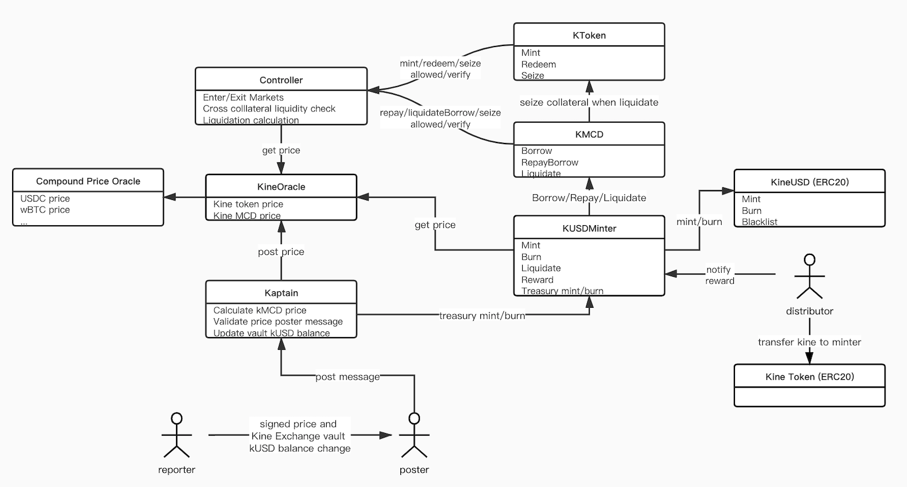

# Contracts Overview

## Architecture




Two brief diagrams as above shows composition of Kine contracts and how should users interact with them. `KToken` contracts accept staking assets from users and mint transferrable kTokens from which users can redeem the staking assets. `Controller` contract acts as the risk controller by allowing or rejecting user actions according to their collateral vs. liquidity states. `KMCD` contracts keep records of Multi Collateral Debts (MCD) and work with Minter contracts to control to supply of kUSD. `Kaptain` contract along with `KineOracle` contract keep updating asset and debt prices to feed `Controller` and `Minter` for their calculations.


### KToken

---

`KToken` contracts implement the functionality of staking assets as collateral to users. By staking assets to `KToken` contracts, stakers gain (mint) kTokens representing their staking balances and may use these balances as liquidation to increase their Liquidity Debt Limit in order to mint kCurrency. The minted kTokens can be redeemed partially or in full to withdraw the assets, or be transferred to others following ERC20 protocol. Before kTokens being redeemed or transferred, `Controller` contract will check if the owner's collateral is sufficient against its Liquidation Debt to allow or reject transactions.

Each type of staking asset is contained by a `KToken` contract. There are currently two kinds of kTokens, `KEther` and `KErc20`, which manage ether and ERC20 tokens respectively. `KErc20` follows [DelegateProxy](https://eips.ethereum.org/EIPS/eip-897) pattern for upgradability, where `KErc20Delegator` is the storage contract while `KErc20Delegate` is the logic implementation contract.

<span style="color:green">**Mint**</green>

Transfer underlying ERC20 tokens into `KErc20` contract or ether to `KEther` contract as collateral and mint equivalent amount of kTokens to `msg.sender`.

**`KErc20`**

```solidity
function mint(uint mintAmount) external returns (uint)
```

- `msg.sender`: The account which shall stake the asset, and gain the minted kTokens.
- `mintAmount`: The amount of the asset to be staked, in units of the underlying asset.
- `RETURN`: The minted kToken amount.

Before supplying an asset, users must first approve the kToken to access their token balance.

**`KEther`**

```solidity
function mint() external payable returns (uint)
```

- `msg.sender`: The account which shall stke the asset, and gain the minted kTokens.
- `msg.value`: The amount of ether to be supplied, in wei.
- `RETURN`: The actual minted kToken amount.

<span style="color:green">**Redeem**</green>

Burn kTokens from `msg.sender`, and transfer equivalent amount of ERC20 tokens from `KErc20` contract or ether from `KEther` contract to `msg.sender`. Will check msg.sender's liquidity first through `Controller` contract and be rejected if liquidity is not sufficient after transfer.

**`KErc20/KEther`**

```solidity
function redeem(uint redeemTokens) external
```

- `msg.sender`: The account to which redeemed asset shall be transferred.
- `redeemTokens`: The number of kTokens to be redeemed.

<span style="color:green">**Transfer**</green>

Transfer kTokens from `msg.sender` to another address. Will check `msg.sender`'s liquidity first through `Controller` contract and be rejected if liquidity is not sufficient after transfer.

**`KErc20`**

```solidity
function transfer(address dst, uint256 amount) external returns (bool)
```

- `dst`: The transfer recipient address.
- `amount`: The amount of kTokens to transfer.
- `RETURN`: Returns a boolean value indicating whether or not the operation succeeded.

<span style="color:green">**GetCash**</green>

Show total balance of underlying asset owned by this kToken contract.

**`KErc20/KEther`**

```solidity
function getCash() external view returns (uint)
```

- `RETURN`: Balance of underlying asset owned by this contract.

<span style="color:green">**TotalSupply**</green>

Total Supply is the number of tokens currently in circulation in this kToken market.

**`KErc20/KEther`**

```solidity
function totalSupply() external view returns (uint)
```

- `RETURN`: The total number of tokens in circulation for the market.

<span style="color:green">**KeyEvents**</green>

```solidity
Mint(address minter, uint mintAmount, uint mintTokens) // Emitted upon a successful Mint.
Redeem(address redeemer, uint redeemTokens) //Emitted upon a successful Redeem.
Transfer(address indexed from, address indexed to, uint amount) //Emitted upon a successful Transfer.
```


### KMCD

---

Multi Collateral Debt are implemented by `KMCD` contracts. Each `KMCD` contract can hold its own logic on debt creation and utilization.

Currently there are only one `KMCD` contract in Kine Protocol, which incur debt when user mint kUSD through `KUSDMinter` contract. The minted kUSD shall be used to trade synthetic assets in Kine Exchange.

The `KMCD` contract works as a debt ledger and cannot interact directly with external users. When users mint/burn kUSD on `KUSDMinter` contract, the minter will call `KMCD` contract to borrow/repay debt on their behalf.

`KMCD` also follows [DelegateProxy](https://eips.ethereum.org/EIPS/eip-897) pattern for upgradability.

<span style="color:green">**BorrowBehalf**</green>

Only called by `KUSDMinter` contract when user mint kUSD. Will create a kMCD borrow balance to the user. The amount borrowed must be less than the borrower's liquidity.

```solidity
function borrowBehalf(address payable borrower, uint borrowAmount) onlyMinter external
```

- `msg.sender`: The caller must be `KUSDMinter` contract, otherwise will revert.
- `borrower`: The account to which borrowed kMCD balance shall be created.
- `borrowAmount`: The amount of the kMCD to be borrowed.

<span style="color:green">**RepayBorrowBehalf**</green>

Only called by `KUSDMinter` contract when user burn kUSD. Will reduce the user's kMCD borrow balance.

```solidity
function repayBorrowBehalf(address borrower, uint repayAmount) onlyMinter external
```

- `msg.sender`: The caller must be `KUSDMinter` contract, otherwise will revert.
- `borrower`: The account from whom borrowed kMCD balance shall be reduced.
- `repayAmount`: The amount of the kMCD to be reduced.

<span style="color:green">**LiquidateBorrowBehalf**</green>

Only called by `KUSDMinter` contract when a liquidator burns kUSD to liquidate another borrower. When a user becomes under-collateralized (has negative liquidity), a third party can liquidate its kMCD by repaying some or all (`Close Factor`) of its borrowed kMCD and receive an amplified (`Liquidation Incentive`) amount of collateral.

```solidity
function liquidateBorrowBehalf(address liquidator, address borrower, uint repayAmount, KTokenInterface kTokenCollateral) onlyMinter external
```

- `msg.sender`: The caller must be `KUSDMinter` contract, otherwise will revert.
- `liquidator`: The account which shall liquidate the borrower by repaying their kMCD and seizing their collateral.
- `borrower`: The account with negative account liquidity that shall be liquidated.
- `repayAmount`: The amount of the borrowed kMCD to be repaid and converted into collateral.
- `kTokenCollateral`: The address of the kToken currently held as collateral by a borrower, that the liquidator shall seize.

<span style="color:green">**BorrowBalance**</green>

Returns given account's borrowed kMCD balance.

```solidity
function borrowBalance(address account) public view returns (uint)
```

- `account`: The account of whom kMCD balance is queried.
- `RETURN`: The borrowed kMCD balance of account.

<span style="color:green">**TotalBorrows**</green>

Returns total amount of borrowed kMCD.

```solidity
function totalBorrows() public view returns (uint)
```

- `RETURN`: The total borrowed kMCD balance.

<span style="color:green">**KeyEvents**</green>

```solidity
Borrow(address borrower, uint borrowAmount, uint accountBorrows, uint totalBorrows) // Emitted upon a successful Borrow.
RepayBorrow(address payer, address borrower, uint repayAmount, uint accountBorrows, uint totalBorrows) //Emitted upon a successful RepayBorrow.
LiquidateBorrow(address liquidator, address borrower, uint repayAmount, address kTokenCollateral, uint seizeTokens) //Emitted upon a successful LiquidateBorrow.
```


### Controller

---

`Controller` implements the risk management functionality of the Kine Protocol. `Controller` evaluates users' liquidity on their attempts to withdraw collaterals or take on more debts. It projects user-selected (by calling `Enter Markets` and `Exit Market`) staking assets in `KToken` contracts by `Collateral Factor` and asset prices (through `KineOracle`) to user's liquidity, and control the amount of debt user can incur (`borrow`) or reduce (`repay`) in consequence. When a user becomes under-collateralized, `Controller` calculates the proportion of its debt subject to liquidation by `Close Factor`, and the amplified amount of collaterals by `Liquidation Incentive` to be seized by liquidators.

`Controller` holds references of all supported `KToken`/`KMCD` instances, `KineOracle` instance and provides functions to evaluate if transactions in `KToken`, `KMCD` are allowed or not. In certain conditions, `admin` and `pauseGuardian` can `pause` and `unpause` through `Controller` contract.

`Controller` follows [DelegateProxy](https://eips.ethereum.org/EIPS/eip-897) pattern for upgradablity.

<span style="color:green">**EnterMarkets**</green>

Enter markets, mark a list of staked `KToken` assets as account's liquidity providers.

```solidity
function enterMarkets(address[] memory kTokens) public
```

- `msg.sender`: The account which shall enter the given markets.
- `kTokens`: The addresses of the kToken markets to enter.

<span style="color:green">**ExitMarket**</green>

Exit market, remove a `KToken` asset from sender's account liquidity calculation.

```solidity
function exitMarket(address kTokenAddress) external
```

- `msg.sender`: The account which shall exit the given market.
- `kTokenAddress`: The address of kToken market to exit.

<span style="color:green">**GetAssetsIn**</green>

List markets the account is currently entered into.

```solidity
function getAssetsIn(address account) external view returns (KToken[] memory)
```

- `account`: The account whose list of entered markets shall be queried.
- `RETURN`: The addresses of markets which is currently entered into.

<span style="color:green">**Markets (Collateral Factor)**</green>

List all markets with each market's `Collateral Factor` that `Controller` currently support.

```solidity
function markets(address kTokenAddress) view returns (bool, uint)
```

- `kTokenAddress`: The address of the kToken to check if listed and get the collateral factor for.
- `RETURN`: Tuple of values (isListed, collateralFactorMantissa); isListed represents whether the controller recognizes this kToken; collateralFactorMantissa, scaled by 1e18, is multiplied by a supply balance to determine how much liquidation is provided.

<span style="color:green">**Get Account Liquidity**</green>

Account Liquidity represents the USD value of kMCD borrowable by a user, before it reaches liquidation. Users with a shortfall (negative liquidity) are subject to liquidation, and can’t withdraw or borrow kMCD until Account Liquidity is positive again.

For each market the user has entered into, their supplied balance is multiplied by the market’s collateral factor, and summed; kMCD borrow balances are then subtracted, to equal Account Liquidity. Borrowing kMCD reduces Account Liquidity; withdrawing an asset reduces Account Liquidity by the asset’s collateral factor times each USD withdrawn.

```solidity
function getAccountLiquidity(address account) public view returns (uint, uint)
```

- `account`: The account whose liquidity shall be calculated.
- `RETURN`: Tuple of values (liquidity, shortfall). A non-zero liquidity value indicates the account has available account liquidity. A non-zero shortfall value indicates the account is currently below his/her collateral requirement and is subject to liquidation. At most one of liquidity or shortfall shall be non-zero.

<span style="color:green">**Close Factor**</green>

The percent, ranging from 0% to 100%, of a liquidate-able account's kMCD borrow that can be repaid in a single liquidate transaction.

```solidity
function closeFactorMantissa() view returns (uint)
```

- `RETURN`: The closeFactor, scaled by 1e18, is multiplied by kMCD borrow balance to determine how much could be closed.

<span style="color:green">**Liquidation Incentive**</green>

Get the amplify factor of seizing collateral in liquidation.

```solidity
function liquidationIncentiveMantissa() view returns (uint)
```

- `RETURN`: The liquidationIncentive, scaled by 1e18, is multiplied by the closed kMCD borrow amount from the liquidator to determine how much collateral can be seized.

<span style="color:green">**KeyEvents**</green>

```solidity
MarketEntered(KToken kToken, address account) //Emitted upon a successful Enter Market.
MarketExited(KToken kToken, address account) //Emitted upon a successful Exit Market.
```


### KineUSD

---

`KineUSD` is an ERC20 which can be paused and prevent blacklist users to transfer. `KUSDMinter` is the minter of `KineUSD` and the interface to users to transit their debt to kUSD or vice versa.

<span style="color:green">**Mint**</green>

Only called by `KUSDMinter`, mint kUSD to account.

```solidity
function mint(address account, uint amount) external onlyMinter
```

- `msg.sender`: The caller can only be `KUSDMinter` contract, otherwise will revert.
- `account`: The account whom the kUSD shall mint to.
- `amount`: The amount of kUSD to mint.

<span style="color:green">**Burn**</green>

Only called by `KUSDMinter`, burn kUSD from account.

```solidity
function burn(address account, uint amount) external onlyMinter
```

- `msg.sender`: The caller can only be KUSDMinter contract.
- `account`: The account from whom the kUSD shall be burnt from.
- `amount`: The amount of kUSD to be burnt.

<span style="color:green">**KeyEvents**</green>

```solidity
Transfer(address indexed from, address indexed to, uint256 value) //Emitted upon a successful Transfer/Mint/Burn
```


### KUSDMinter

---

`KUSDMinter` contract let users to borrow/repay kMCD to mint/burn kUSD. When user mint/burn kUSD, `KUSDMinter` will borrow/repay equivalent kMCD from ``KMCD`` contract on behalf of user according to kMCD price then. The actions will go through `Controller` to check user's liquidity and permit or forbid actions.

`KUSDMinter` is also the interface for users to liquidate other users' kMCD if they are under-collateralized in order to seize an amplified collateral.

`KUSDMinter` also allows Kine Exchange treasury account to update kUSD vault's balance to keep kUSD total supply synced with the total value of synthetic assets in Kine Exchange.

Users who borrowed kMCD to mint kUSD become the pooled counter parties in Kine Exchange, they took the risks that kMCD price may fluctuate. A proportion of trading fees together with Kine token reward will be distributed into `KUSDMinter` contract to reward these users. The reward will be periodically added to minter contract and will released to users in a preset release period.

`KUSDMinter` follows [DelegateProxy](https://eips.ethereum.org/EIPS/eip-897) pattern for upgradablity.

<span style="color:green">**Mint**</green>

Borrow kMCD on behalf of user according to kMCD price and mint specified amount of kUSD to `msg.sender`. Borrowing kMCD will trigger `Controller` to check user's liquidity to allow or reject the transaction. There is a start time only after which can users mint kUSD.

```solidity
function mint(uint kUSDAmount) external checkStart updateReward(msg.sender)
```

- `msg.sender`: The account to whom kUSD will mint to.
- `kUSDAmount`: The amount of kUSD to mint.

<span style="color:green">**Burn**</green>

Burn specified amount of kUSD from `msg.sender` and repay kMCD according to kMCD price on behalf of user. There is a start time only after which can users burn kUSD. There is a cool-down time before user can burn kUSD after last kUSD minting. This is to prevent bots from front running MCD price update by taking and repaying debt in short periods.

```solidity
function burn(uint kUSDAmount) external checkStart afterCooldown(msg.sender) updateReward(msg.sender)
```

- `msg.sender`: The account from whom kUSD will burn.
- `kUSDAmount`: The amount of kUSD to burn

<span style="color:green">**BurnMax**</green>

Burn equivalent kUSD to `msg.sender`'s outstanding kMCD debt value. If kUSD balance is not sufficient, will burn all kUSD to repay debt. There is a start time only after when can users burn kUSD. There is a cool-down time before user can burn kUSD after last kUSD minting. This is to prevent bots from front running MCD price update by taking and repaying debt in short periods.

```solidity
function burnMax() external checkStart afterCooldown(msg.sender) updateReward(msg.sender)
```

- `msg.sender`: The account from whom kUSD will burn.

<span style="color:green">**Liquidate**</green>

Burn `msg.sender`'s kUSD and call `KMCD` `liquidateBehalf` function (see `KMCD`) on behalf of `msg.sender`to liquidate staker's kMCD. If kUSD amount need to be burnt reached given `maxBurnKUSDAmount`, will revert.

```solidity
function liquidate(address staker, uint unstakeKMCDAmount, uint maxBurnKUSDAmount, address kTokenCollateral) external checkStart updateReward(staker)
```

- `msg.sender`: The account which shall liquidate the borrower by repaying their kMCD and seizing their collateral.
- `staker`: The account with negative account liquidity that shall be liquidated.
- `unstakeKMCDAmount`: The amount of the borrowed kMCD to be repaid and converted into collateral.
- `maxBurnKUSDAmount`: The maximum allowed kUSD amount to be burnt to repay kMCD.
- `kTokenCollateral`: The address of the kToken currently held as collateral by staker, that the liquidator shall seize.

<span style="color:green">**Reward Earned**</green>

Return account's accrued reward.

```solidity
function earned(address account) public view returns (uint)
```

- `account`: The account of whom accrued reward shall be shown.
- `RETURN`: The accrued reward.

<span style="color:green">**Reward Claimable**</green>

Return account's matured reward. User's accrued reward will mature gradually in a given release period. The proportion of matured reward to accrued reward is the proportion of past time since last claim to the release period.

```solidity
function claimable(address account) external view returns (uint)
```

- `account`: The account of whom matured reward shall be shown.
- `RETURN`: The matured reward.

<span style="color:green">**Get Reward**</green>

Transfer matured reward to `msg.sender` and start a new release period for left and new accrued reward.

```solidity
function getReward() external checkStart updateReward(msg.sender)
```

- `msg.sender`: The account matured reward will be transferred to.

<span style="color:green">**Treasury Mint**</green>

Only called by Kine Exchange treasury account (see `Kaptain`), mint kUSD to Kine vault to keep kUSD total supply in line with the total debt value of the pool.

```solidity
function treasuryMint(uint amount) external onlyTreasury
```

- `msg.sender`: The treasury account of Kine system.
- `amount`: The increased value of synthetic assets of Kine Exchange.

<span style="color:green">**Treasury Burn**</green>

Only called by Kine Exchange treasury account (see `Kaptain`), burn kUSD from Kine vault to keep kUSD total supply in line with the total debt value of the pool.

```solidity
function treasuryBurn(uint amount) external onlyTreasury
```

- `msg.sender`: The treasury account of Kine system.
- `amount`: The decreased value of synthetic assets of Kine Exchange.

<span style="color:green">**KeyEvents**</green>

```solidity
Mint(address indexed user, uint mintKUSDAmount, uint stakedKMCDAmount, uint userStakesNew, uint totalStakesNew) //Emitted upon a successful Mint.
Burn(address indexed user, uint burntKUSDAmount, uint unstakedKMCDAmount, uint userStakesNew, uint totalStakesNew) //Emitted upon a successful Burn.
BurnMax(address indexed user, uint burntKUSDAmount, uint unstakedKMCDAmount, uint userStakesNew, uint totalStakesNew) //Emitted upon a successful BurnMax.
Liquidate(address indexed liquidator, address indexed staker, uint burntKUSDAmount, uint unstakedKMCDAmount, uint stakerStakesNew, uint totalStakesNew) //Emitted upon a successful Liquidate.
TreasuryMint(uint amount) //Emitted upon a successful TreasuryMint.
TreasuryBurn(uint amount) //Emitted upon a successful TreasuryBurn.
```


### KineOracle

---

Kine Protocol adopts the `OpenOraclePriceData` contracts by Compound as price feeds for common assets. There is a customised view contract `KineOracle` to store prices that are signed by reporters hosted by Kine.

The MCD price is defined to be the product of the total supply of kUSD divided by the total borrowed balance of MCD.

kMCD price is calculated immediately after Vault kUSD balance getting updated. `Kaptain` contract is responsible for updating kUSD balance in Kine vault via `KUSDMinter`, calculating kMCD price and posting it along with other token prices to `KineOracle` all in the same transaction.

Kine vault kUSD balance change is calculated from Kine Exchange, so only Kine Exchange can post the prices for now.

<span style="color:green">**Post Prices**</green>

Post an array of prices to `OpenOraclePriceData` and saves them to `KineOracle`. Prices are expected to be in USD with 6 decimals of precision.

**`KineOracle`**

```solidity
function postPrices(bytes[] calldata messages, bytes[] calldata signatures, string[] calldata symbols) external onlyKaptain
```
- `msg.sender`: The caller can only be the Kaptain contract
- `messages[]`: The array of prices to sign. Each message is a bytes[] with the format: (string memory kind, uint64 timestamp, string memory key, uint64 value)
- `signatures[]`: An array of signatures corresponding to the messages. Each signature is a bytes[] with the format (bytes32 r, bytes32 s, uint8 v).
- `symbols[]`: An array of symbols corresponding to the price messages.

<span style="color:green">**Post MCD price**</green>

Save kMCD price to `KineOracle`. Price is expected to be in USD with 6 decimals of precision. 

**`KineOracle`**

```solidity
function postMcdPrice(uint mcdPrice) external onlyKaptain
```

- `mcdPrice`: MCD price scaled by 1e6.

<span style="color:green">**Price**</green>

Get the most recent price for a token in USD with 6 decimals of precision.

**`KineOracle`**

```solidity
function price(string memory symbol) external view returns (uint)
```

- `symbol`: Symbol as a string
- `RETURN`: price for a token in USD with 6 decimals of precision.

<span style="color:green">**GetUnderlyingPrice**</green>

Get the most recent price for an underlying token of kToken in USD scaled by 1e(36 - token decimals).

**`KineOracle`**

```solidity
function getUnderlyingPrice(address kToken) external view returns (uint)
```

- `kToken`: kToken address of which underlying token price will be get.
- `RETURN`: underlying token price of kToken in USD scaled by 1e(36 - token decimals).


### Kaptain

---

`Kaptain` contract is responsible for updating kUSD balance in Kine vault via `KUSDMinter`, calculating kMCD price and posting it along with other token prices to `KineOracle` all in the same transaction.

<span style="color:green">**Steer**</green>

Called only by Kine Exchange poster, will call `KUSDMinter`'s `treasuryMint`/`treasuryBurn` to update Kine Exchange vault kUSD balance, calculate kMCD price and post prices to `KineOracle` in the same transaction.

```solidity
function steer(bytes calldata message, bytes calldata signature) external onlyPoster
```

- `msg.sender`: Only poster can call this function.
- `message`: The report data to sign with the format: (bytes[] memory messages, bytes[] memory signatures, string[] memory symbols, uint256 vaultKusdDelta, bool isVaultIncreased, uint256 nonce)
- `signature`: Signature of the messages with the format (bytes32 r, bytes32 s, uint8 v).